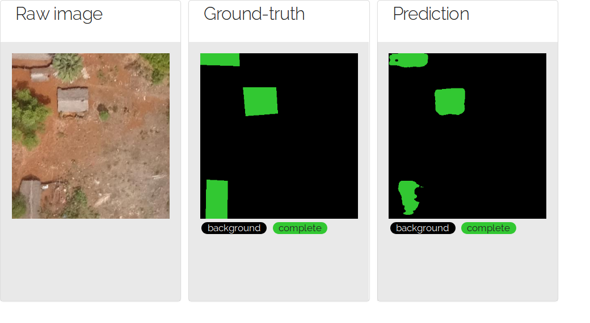

This project aims at showcasing some Deep Learning use cases in terms of image
analysis, especially regarding semantic segmentation.

If you want to get more details on Oslandia activities around this topic, feel
free to visit our [blog](http://oslandia.com/en/blog/). You certainly want to
discover some of our results in the
associated [web application](http://data.oslandia.io/deeposlandia):


# Content

The project contains the following folders:

+ [deeposlandia](./deeposlandia) contains the main Python modules to train and
  test convolutional neural networks
+ [examples](./examples) contains some Jupyter notebooks that aim at
  describing data and building basic neural networks
+ [images](./images) contains some example images to illustrate the Mapillary
  dataset as well as some preprocessing analysis results
+ [tests](./tests); `pytest` is used to launch several tests from this folder.

Additionally, running the code may generate extra subdirectories in the chosen
data repository.

# Installation

## Requirements

The code has been run with Python 3. The dependencies are specified in
`setup.py` file, and additional dependencies for developing purpose are listed
in `requirements-dev.txt`.

### From source

```
$ git clone https://github.com/Oslandia/deeposlandia
$ cd deeposlandia
$ virtualenv -p /usr/bin/python3 venv
$ source venv/bin/activate
(venv)$ pip install -r requirements-dev.txt
```

### GDAL

As a particular case, GDAL is not included into the `setup.py` file.

For `Ubuntu` distributions, the following operations are needed to install this
program:

```
sudo apt-get install libgdal-dev
sudo apt-get install python3-gdal
```

The `GDAL` version can be verified by:

```
gdal-config --version
```

After that, a simple `pip install GDAL` may be sufficient, however considering
our own experience it is not the case on Ubuntu. One has to retrieve a `GDAL`
for Python that corresponds to the `GDAL` of system:

```
pip install --global-option=build_ext --global-option="-I/usr/include/gdal" GDAL==`gdal-config --version`
python3 -c "import osgeo;print(osgeo.__version__)"
```

For other OS, please visit the `GDAL` installation documentation.

## Running the code

- [Data preprocessing](./docs/preprocessing.md)
- [Train a model](./docs/training.md)
- [Infer labels](./docs/inference.md)

# Supported datasets

## Mapillary

In this project we use a set of images provided
by [Mapillary](https://www.mapillary.com/), in order to investigate on the
presence of some typical street-scene objects (vehicles, roads,
pedestrians...). Mapillary released this dataset on July 2017, it
is [available on its website](https://www.mapillary.com/dataset/vistas) and may
be downloaded freely for a research purpose.

As inputs, Mapillary provides a bunch of street scene images of various sizes
in a `images` repository, and the same images after filtering process in
`instances` and `labels` repositories.

There are 18000 images in the training set, 2000 images in the validation set,
and 5000 images in the testing set. The testing set is proposed only for a
model test purpose, it does not contain filtered versions of images. The raw
dataset contains 66 labels, splitted into 13 categories. The following figure
depicts a prediction result over the 13-labelled dataset version.


## AerialImage (Inria)

In
the
[Aerial image dataset](https://project.inria.fr/aerialimagelabeling/files/),
there are only 2 labels, i.e. `building` or `background` and consequently the
model aims at answering one single question for each image pixel: does this
pixel belongs to a building?

The dataset contains 360 images, one half for training one half for
testing. Each of these images are 5000*5000 `tif` images. Amongst the 180
training images, we assigned 15 training images to validation. One example of
this image from this dataset is depicted below.


## Open AI Tanzania

This dataset comes from
the
[Tanzania challenge](https://blog.werobotics.org/2018/08/06/welcome-to-the-open-ai-tanzania-challenge/),
that took place at the autumn 2018. The dataset contains 13 labelled images (2
of them were assigned to validation in this project), and 9 additional images
for testing purpose. The image resolution is very high (6~8 cm per pixel), that
allowing a fine data preprocessing step.

In such a dataset, one tries to automatically detect building footprints by
distinguishing complete buildings, incomplete buildings and foudations.



## Shapes

To complete the project, and make the test easier, a randomly-generated shape
model is also available. In this dataset, some simple coloured geometric shapes
are inserted into each picture, on a total random mode. There can be one
rectangle, one circle and/or one triangle per image, or neither of them. Their
location into each image is randomly generated (they just can't be too close to
image borders). The shape and background colors are randomly generated as well.

## How to add a new dataset?

If you want to contribute to the repo by adding a new dataset, please consult the [following instructions](./docs/add_a_dataset.md).

## Pre-trained models

This project implies non-commercial use of datasets, anyway we can work with
the dataset emitters to get commercial licences if it fits your demand. May you
be interested in any pre-trained models, please contact us at
infos+data@oslandia.com!

# Flask application

A Flask Web application may be launched locally through
`deeposlandia/run_webapp.py`. By default, it is launched on `0.0.0.0/7897`.

Some symbolic links are needed to make the application work (in development
mode):
+ `deeposlandia/static/sample_images` must contain the sample images, depicted
  on application homepage as well as in demonstration web pages (before new
  images are generated).
+ `deeposlandia/static/shapes` refers to the server-side repository that
  contains shapes images and their labels.
+ `deeposlandia/static/mapillary_agg` refers to the server-side repository that
  contains Mapillary images and their aggregated labels, *i.e.* 13 labels that
  summarize the content of the 66 native Mapillary labels.
+ `deeposlandia/static/predicted_images` links to a temporary repository (for
  instance, `/tmp/deeposlandia/predicted/`) that contains images generated
  during the app session as well as their corresponding predicted labelled
  version.

These symlinks are created when the web application is launched. Their name as
well as their destination are defined in `config.ini`, a config file located on
the project root.

# License

The program license is described in [LICENSE.md](./LICENSE.md).

___

Oslandia, April 2018
